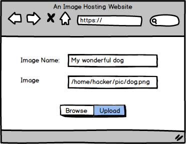
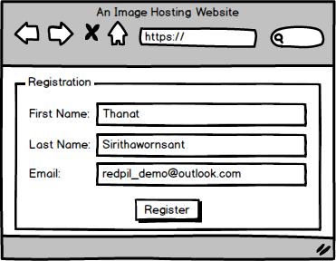
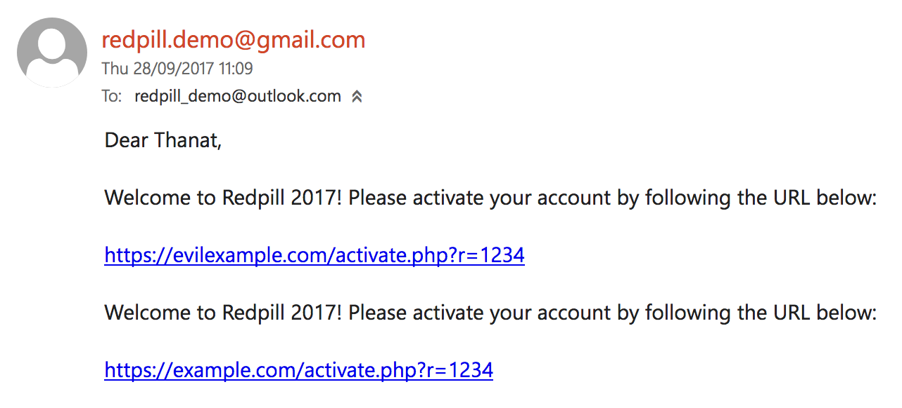
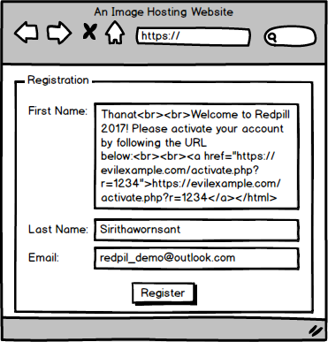
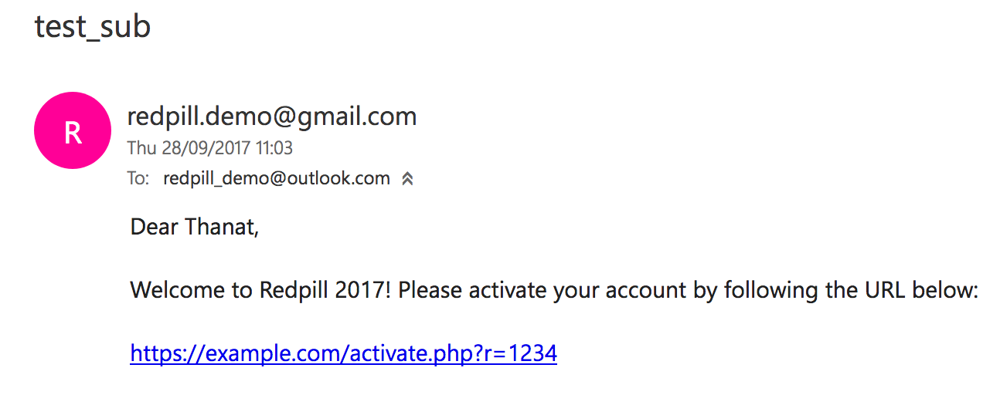

# Tales from a fortune cookie

Thanat Sirithawornsant

---

## whoami

- 22 years old penetration tester/consultant
- studied software engineering in 2 universities
  - 2 years in King Mongkut's Institute of Technology Ladkrabang
  - 2 years in University of Glasgow (Scotland)
- has ~1 year working professionally
- based in Oxford, UK

Note: started reading code since 9 yo

---

## what kind of tales

This

- is about pentest tricks I've learned and experienced in my first year of working professionally
- may not be the only workaround or trick
- is not about 0day or Nday, or maybe?

---

## agenda

3 tales to tell

1. when time is critical, do something meaningful
1. standards are good
1. a bug or a feature

---

#### when time is critical, do something meaningful (1)

<strong>hackers</strong> are known to exploit vulnerabilities and bypass any defence mechanism that gets in their way.

<strong>pentesters</strong> are supposed to do the same in sort of a way, but they cannot replicate a real-world scenario due constraints such as time.

+++

#### when time is critical, do something meaningful (2)

testing file upload forms on a website is all about uploading files that are not supposed to be on the website, such as the following:

- web shell (e.g. PHP file)
- malware
- extremely large file

an awesome checklist for testing from [Aptive](https://www.aptive.co.uk/blog/unrestricted-file-upload-testing/)

<!-- footnote : "<a style='text-decoration:none; color: white;' href='https://www.aptive.co.uk/blog/unrestricted-file-upload-testing'>https://www.aptive.co.uk/blog/unrestricted-file-upload-testing</a>" -->

+++

#### when time is critical, do something meaningful (3)

first thing to do is not trying to bypass the website's defence mechanisms, but to observe and make (educated) assumptions.

+++

#### when time is critical, do something meaningful (4)

uploading a legitimate image and observe what the application really does

```text
$ sha1sum dog.png
1ad4ea1e3c65a01afd8160aaf02c48f61497be6d dog.png
```

<div align='center'>
 
</div>

+++?code=assets/code/fileupload_request.txt

@[5]
@[6]
@[8]

+++

#### when time is critical, do something meaningful (5)

once the `dog.png` has been uploaded, find out where it is.

<div align='center'>

</div>

+++

#### when time is critical, do something meaningful (6)

check its hash against the original one.

<pre>
$ sha1sum dog.png
<strong>1ad4ea1e3c65a01afd8160aaf02c48f61497be6d</strong> dog.png
$ sha1sum downloaded_dog.png
<strong>f8b8386de9cb152413beefb48b893cdb20c82fdd</strong> downloaded_dog.png
</pre>

+++

#### when time is critical, do something meaningful (7)

why? what did they do to my precious image!?

- apps tend to save their resources as much as possible, dropping a little image quality to save money seems logical.

Note: this also corrupted the payload you may have injected into your image.

+++

#### when time is critical, do something meaningful (8)

shall I spend hours trying to bypass whatever they have?

- probably not, unless you have really good reasons or evidence that shows you the potential
- or only if you could reverse engineer the algorithm and get lucky by spending more time to understand

+++

#### when time is critical, do something meaningful (9)

moral of the story

<strong>`don't try to blindly throw thousands of payloads! do some experiments, observations, and try to understand what's really going on`</strong>

Note: summary

---

#### standards are good (1)

Request for Comments (RFC):

[https://tools.ietf.org/rfc/index]()

Note: internet standards are commonly promoted from IETF's RFC. as usual, people may not follow.

+++?code=assets/code/uri_syntax.txt

@[1-6]

##### RFC 3986 - Uniform Resource Identifier (URI): Generic Syntax

+++?code=assets/code/semantic_attacks.txt

##### misleading URI

+++?code=assets/code/redir_response.txt

##### this, somehow, also affects web browsers, which they will redirect you to the evil site

+++

#### standards are good (2)

bad dev: so what? how would an attacker does that?

hacker: combine it with open URL redirection attack, and it will help you with some restriction!

+++?code=assets/code/redir_hardcoded_host.txt

@[1,2,6]

##### bad devs prepended their hostname at the Location header hoping they'll be safe

+++?code=assets/code/redir_hardcoded_host_attack.txt

@[1-2,6-7]

##### now, if an attacker gives this URL to a target, it'd make their web browser redirect to the evil site

+++

#### standards are good (3)

work seamlessly in Chrome but not Firefox!

see demo!

+++

#### standards are good (4)

moral of the story

<strong>`when it comes to security, ensure you do things properly. if you cannot do it in a reasonable amount of time, find someone who can`</strong>

yes, hire a professional :P

Note: summary

---

#### a bug or a feature (1)

email html injection occurs when there is no input sanitisation/validation.

+++

#### a bug or a feature (2)

<div align='center'>

</div>

+++

#### a bug or a feature (3)

<div align='center'>

</div>

+++

#### a bug or a feature (4)

<div align='center'>

</div>

+++

#### a bug or a feature (5)

<div align='center'>

</div>


+++

#### a bug or a feature (6)

bad people always use this type of techniques to social engineer users, manipulate them to have them do what they want :(

+++

#### a bug or a feature (7)

bad dev: okay, but I've put a bunch of crap in the email, users are going to suspect!

hacker: watch this!

+++

#### a bug or a feature (8)

| Email Client           | Affect |
| ---------------------- |:------:|
| Outlook Desktop Client | yes    |
| Outlook Web Client     | yes    |
| Android Gmail Client   | yes    |
| Gmail Web Client       | no     |
| iOS Mail Client        | no     |
| macOS  Mail Client     | no     |
| Thunderbird            | no     |

+++

#### a bug or a feature (9)

- why is it acting like that?
- was it its syntax?
- is it a bug or a feature?

+++

#### a bug or a feature (10)

moral of the story

<strong>`sanitise and validate user input, and properly encode them where appropriate`</strong>

Note: summary

---

#### Questions?
